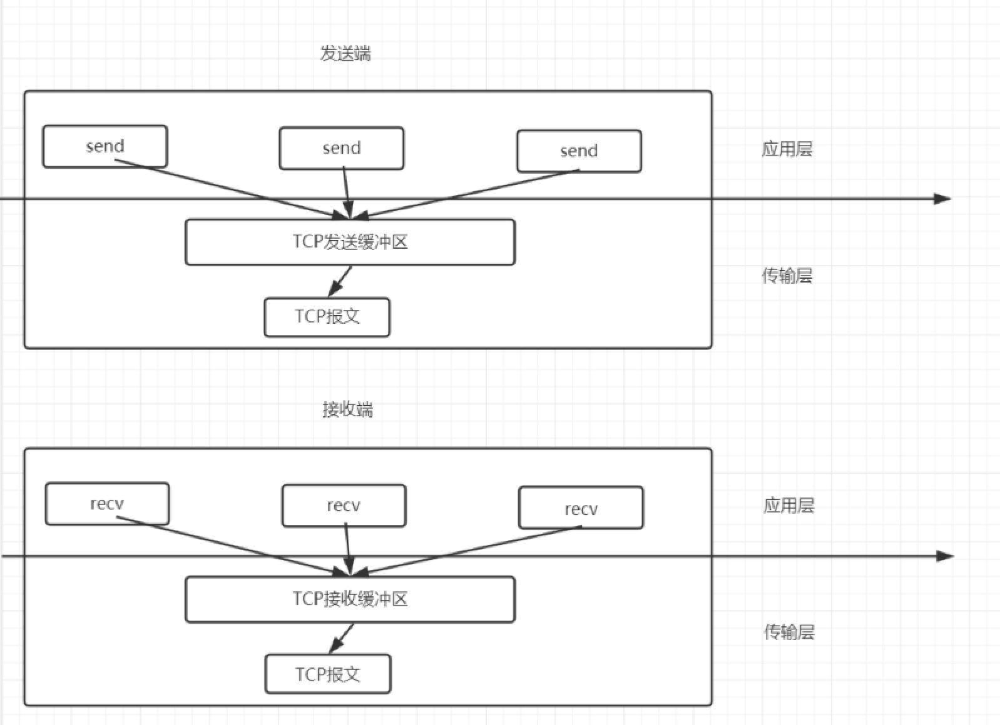

 网络协议⚡️
## TCP/IP 和 UDP/IP
**TCP/IP**:(Transmission Control Protocol/Internet Protocol) 是一种可靠的`网络数据传输控制协议`。定义了主机如何连入因特网以及数据如何在他们之间传输的标准。
TCP/IP协议参考模型把所有TCP/IP系列协议归类到四个抽象层中。
每一个抽象层都建立在低一层提供的服务上，并且为高一层提供服务


**OSI模型**：（开放式系统互联通信参考模型），它是由国际标准化组织提出的，试图使各种计算机在世界范围内互联为网络的标准框架
OSI模型多了表达层、会话层

## 3次握手
所谓三次🤝（Threee-Way handshake）即建立连接，客户端和服务器总共需要发送`3`个包以确认连接建立

sql:同步序列号  ack:确认号    syn:标志位
第一次🤝: client端将SYN标识置为1 + 生成一个随机值sql(J)，并将改数据发送给server端，进入SYN_SEND
第二次🤝: server端收到SYN=1,知道client请求连接，将SYN和ACK都置为1，ack=J+1，随机生成一个seq=K,发送这些数据给client端，Server端进入SYN_RECVD
第三次🤝: client端收到后，校验ack是否为J+1,ACK是否为1，正确的话就将标识ACK置为1，ack=K+1,并将数据包发送给服务端，双方都进入ESTABLISHED状态，由此可以为所欲为了
### SYN攻击
在服务器端发送SYN ACK 之后，收到Client的ACK之前，服务器被大量的未知IP的SYN 请求占用，无法发送，不断尝试，占用资源，导致正常的请求没法处理。
查看是否受攻击了：
```bash
netstat -nap | grep SYN_RECV
```

## 4次挥手
四次挥手（Four-Way WaveHand），因为tcp/ip 通信是全双工的，so,双方都需要确认，需要发送四个包确认连接已断开。


## TCP通信原理
1). 对于TCP通信来说，每个TCP Socket的内核中都有一个`发送缓冲区`和一个`接收缓冲区`，TCP的全双工的工作模式及TCP的滑动窗口就是依赖于这两个独立的Buffer和该Buffer的填充状态。
2). `接收缓冲区`把数据`缓存到内核`，若应用进程一直没有调用Socket的read方法进行读取，那么该数据会一直被缓存在接收缓冲区内。不管进程是否读取Socket，发送端发来的数据都会经过内核接收并缓存到Socket的内核接收缓冲区。
3). Read 要做的工作，就是把`内核接收缓冲区中的数据`复制到应用层`用户的Buffer`里。


## 滑动窗口
概述：发送方和接收方都会维护一个`数据帧序列`，此序列称为窗口，发送方窗口大小由接受方控制，`避免接收方缓存不够大导致溢出`，同时达到`限流`，避免网络阻塞。
如下图：4,5,6 已发送，但为收到ACK,7,8,9帧则是等待发送，可以看出窗口的大小是6，（4）确认后，窗口会向右侧滑动


### 阻塞模式
明白了Sokcet读写数据的底层原理，阻塞模式就很容易理解了
   1) 对于读socket数据而言，如果数据缓冲区为空，则调用读数据的线程就会一直等待，直到有数据为止
   2) 对于写socket而言，如果数据大于缓冲区，则会阻塞在write方法上，等待发送缓冲区的报文发送到网络上，再去发送下一段，循环这个过程直到数据都被写入缓冲区为止
   
> 从上面分析的过程来看，发送方和接收方无论哪个慢，都会影响到对方，导致对方浪费大量的时间在IO等待上。这种方式只适用于TCP连接少的情况下，这个时候性能最高

## javaSocket通信demo 
原理🔥：
    一个服务器端`ServerSocket`,绑定端口，调用`accept()`方法，这个方法是`阻塞`式的，客户端不传东西过来，服务器端就一直等在这一步。
    一个客户端`Socket`，绑定IP和端口，调用send给服务器端发送消息。


