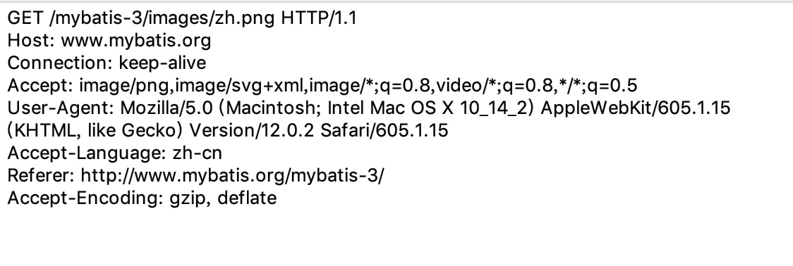
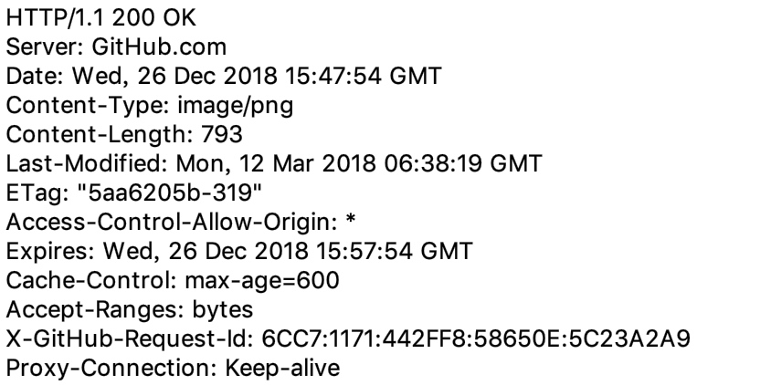
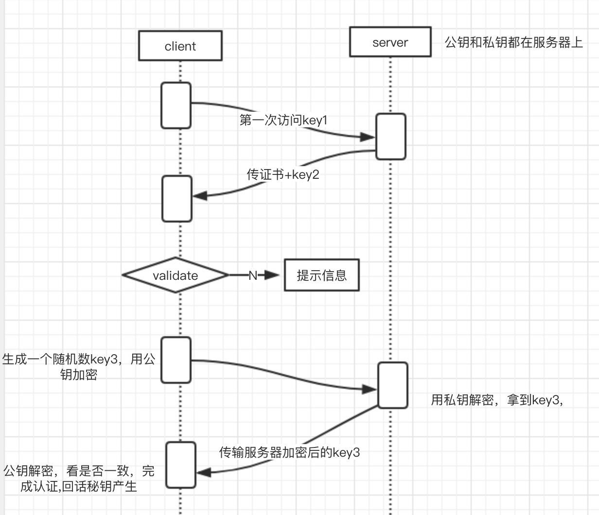

HTTP/HTTPS协议⚡
# HTTP协议
超文本传输协议,建立在TCP/IP协议基础上，默认端口80，明文传输不安全。

- `资源`：html/文本、word、avi电影、其他资源
- `媒体类型`：MIME类型。  text/html、 image/jpeg 
- `URL和URI`
    `URI`: web服务器资源的名称。 示例：index.html
    `URL`: http://www.baidu.com?page=1&size=10
         schema: 约束（http/https/ftp）
         host: 主机IP/域名
         port: 端口
         path: 路径
         query-string: 请求参数
- `方法`： GET/POST/PUT/DELETE/HEAD/OPTIONS

## **报文**:
### request报文

三部分组成：
    - 起始行： METHOD: /path 
    - 头部字段：就是head中定义的键值对
    - 空行
    - 主体：post/put提交带的主体信息
  

### response报文
三部分组成：
    - 起始行：http/version  状态码  状态信息
    - 头部字段：就是head中定义的键值对
    - 空行
    - 主体：post/put提交带的主体信息


#### 状态码
http/1.1 版本的协议里面定义了5中类型的状态码
 - 1XX  提示信息
 - 2XX  成功
 - 3XX  重定向
 - 4XX  客户端错误
 - 5XX  服务器错误

# HTTPS协议
在HTTP协议的基础上加了SSL层，密文传输，安全，默认端口：443

## CRT证书颁发机构
###公钥和私钥的使用：
正常通信传输过程是：
    - 客户端用公钥加密，服务器端用私钥解密，
    - 服务器端用私钥加密，客户端用私钥解密

但公钥需要传递到客户端，在传输过程中可能受到第三方劫持，如果第三方把公钥换成他自己的，自己在伪造一个钓鱼网站，用户这不就炸了💣

### CRT的出现
- 为了防止公钥在传输过程中被劫持，so😝有了第三方机构这个梗，`第三方机构给用它的私钥`给`证书内数字签名`进行加密,再加上服务器端的邮箱、国际等个人信息，由此证书诞生了。

证书传输过程：
- 1）客户端发起请求
    - a)客户端支持的加密方式
    - b)客户端生成的随机数(第一个)
- 2）服务器端收到请求后，拿到随机数，返回
    - a)证书（颁发机构（CA）、证书本身的数字签名（使用第三方机构的私钥加密）、证书持有者的公钥、证书签名用的hash算法）  
    - b)生成一个随机数，返回给客户端（第二个）
- 3）客户端拿到根证书
    - 用内置的第三方机构的根证书，通过根证书解密得到摘要A，用证书提供的算法对证书内容加密，得到B，比较证书的正确性
    - 生成一个随机数，返回给服务器（第三个）
- 4）（三个随机数）通过对称加密得到一个秘钥，回话秘钥产生，回话秘钥对内容进行加密。 


# RESTFUL
`REST` : 2000年一个博士提出来的，Representational State Transfer ，表述性状态转移，方便在网络上传输信息。是在HTTP传输的约束。 满足REST架构风格的就是RESFUL

## 基本概念
- 在REST中，一切内容都别认为一种资源
- 每个资源都由URI唯一标示
- 使用同一的接口处理资源（GET/PUT/DELETE/POST）
- 无状态（服务器端不保存客户端状态）

## RESTFUL 最佳设计
1).域名
```js
http://api.gupaoedu.com 
http://api/gupaoedu.com/api
```

2).版本
```js
http://api.gupaoedu.com/v1/user/1
```

3).路径
```js
http://api.gupaoedu.com/v1/users/{id}
```

4).过滤信息
```js
https://api.github.com/user/repos?page=2&per_page=100
```

5) 状态码
```
业务状态码
http状态码
```


