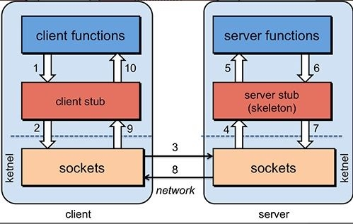
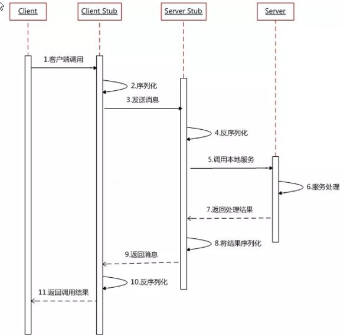

RPC🔥RMI
# RPC协议
远程过程调用（remote procedure call）,在本地调用远程方法，就好像调用本地方法一样，跨域了传输层、应用层

- 为神马会出现？
    TCP协议需要三次握手，四次挥手，http 基于TCP协议会携带很多无用的信息，为了传输效率与安全。

- 实现要点
  - a): 序列化和反序列化
  - b): 网络协议
  - c): Call ID映射

- 过程图

- 时序图

- 实现原理
   配置RPC注册信息，就给它生成一个代理对象，将这个代理对象放进容器中。而这个代理对象的内部，就是通过httpClient来实现RPC调用的。

- 影响RPC效率因素
    - a):客户端能否与服务器【快速】建立连接
    - b):序列化和反序列化的速度

# RMI
远程方法执行，可以认为是RPC的java版本，`基于JRMP`(java remote message protocol),一个纯java实现的分布式解决方案

## 如何编写了？
- 1）创建远程接口，实现java.mi.Remote接口
- 2）创建实现类，让其继承`UnicastRemoteObject`
- 3）创建服务器程序：创建注册中心，并将实现类bind进去
- 4）创建客户端程序，连接注册中心，lookup出代理类

## 如何自定义实现RMI
思路：
    - 服务器端：写一个serverSocket（绑定远程开放接口）,接受客户端的请求，对比接口，执行方法，把执行结果放入socket.OutputStream中
    - 客户端：为隐藏远程调用的细节，为开放接口创建代理对象，代理对象执行方法时，用socket去与服务器建立连接，把`调用参数`放入socket.outPutStream，服务器处理后在用 socket.inputStream接受`调用结果`

# 源码地址
[github地址](https://github.com/anhusky/rpc-base)

    
