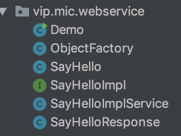
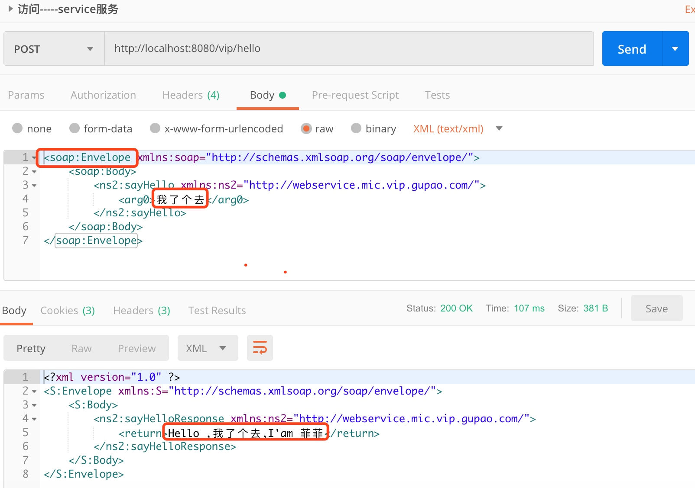
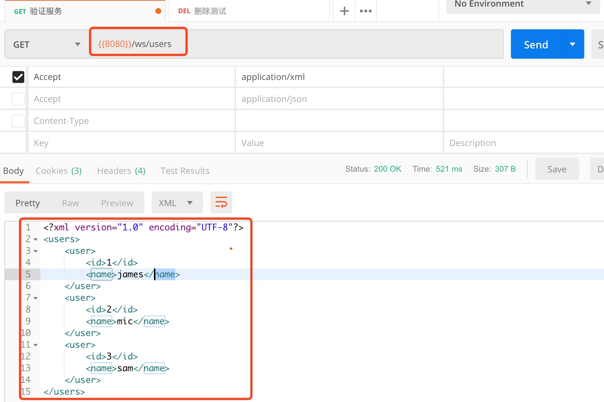

RPC🔥WebService SOAP CXF
# 概述
webService: 
    - 1）依靠`xml`
    - 2）跨语言、跨平台的一种轻量级的web服务
    - 3) 调用者与服务端采用xml进行通信

## 基本概念
- WSDL: web service defination language (webService 定义语言)，基于XML(可扩展标记语言)去定义
    - a) 一个webService 对应一个.wsdl的文件
    - b) 此文件说明webService暴露了哪些服务。接口参数、返回参数

- SOAP: Simple object access protocal (简单对象访问协议),`交换数据的一种协议规范`，`简化WebService数据格式化时间`，使服务可以跨语言、跨平台
    - a) 基于Http和xml，xml请求体
    - b) soap消息：定义了请求和响应信息格式

- SEI: 定义服务器端用户来处理请求的接口，也就是发布出去的接口

## 使用
### 服务提供方
接口
```java
@WebService //SE和SEI的实现类
public interface ISayHello {

    @WebMethod //SEI中的方法
    String sayHello(String name);
}
```
实现类
```java
@WebService
public class SayHelloImpl implements ISayHello {

    public String sayHello(String name) {
        System.out.println("call sayHello()");
        return "Hello ," + name + ",I'am 菲菲";
    }
}
```

运行
```java
// 运行方法
public class Bootstrap {

    public static void main(String[] args) {

        Endpoint.publish("http://localhost:8080/vip/hello",new SayHelloImpl());

        System.out.println("publish success");
    }
}
``` 
### 服务消费方
进入终端（配置好环境变量）,生成客户端调用代码： 
```bash
wsimport -keep http://localhost:8080/vip/hello?wsdl
```
生成的代码如下（class文件和packageInfo文件已删除）：
 

  调用demo如下：
  ```java
  public class Demo {
    public static void main(String[] args) {
        SayHelloImplService service = new SayHelloImplService();
        SayHelloImpl sayHello = service.getSayHelloImplPort();
        System.out.println(sayHello.sayHello("我了个去"));
    }
}
  ```
交互实际上就是基于xml通信，xml在请求体中，用postman测试如下：


  
  
# CXF
基本概念：
    - a) Apache的，两个项目的整合`Celtix` 和 `Xfire`
    - b) 简单易用，高性能，可以与spring整合
    - c) 支持JAX-RS API,RESTFUL风格的设计的API
        JAX用起来跟springMvc差不多😝
## JAX-RS
提供一套API，按照REST风格创建Web服务，简化服务器端和客户端的开发和部署


## 实现

### 配置servlet
web.xml配置如下(主要就是配置好CXFServlet用于拦截请求)：
```xml
<!DOCTYPE web-app PUBLIC
 "-//Sun Microsystems, Inc.//DTD Web Application 2.3//EN"
 "http://java.sun.com/dtd/web-app_2_3.dtd" >

<web-app>
  <display-name>Archetype Created Web Application</display-name>
  <!-- 加载spring容器 -->
  <context-param>
    <param-name>contextConfigLocation</param-name>
    <param-value>classpath:application.xml</param-value>
  </context-param>

  <listener>
    <listener-class>org.springframework.web.context.ContextLoaderListener</listener-class>
  </listener>

  <!-- cxf的servlet -->
  <servlet>
    <servlet-name>CXFServlet</servlet-name>
    <servlet-class>org.apache.cxf.transport.servlet.CXFServlet</servlet-class>
    <load-on-startup>1</load-on-startup>
  </servlet>

  <servlet-mapping>
    <servlet-name>CXFServlet</servlet-name>
    <url-pattern>/ws/*</url-pattern>
  </servlet-mapping>

</web-app>

```

- 在servlet3.0以上在
    在servletContextInilizer的实现类的OnStartUp中去定义Filter、Servlet、ServletListener 等
 
### 配置applicaiton.xml
主要配置jaxrs的server,将实现了jax-rs的service注册到spring中
```xml
<context:component-scan base-package="com.gupao.mic.vip.demo"/>

    <jaxrs:server id="restServiceContainer" address="/">
        <jaxrs:serviceBeans>
            <ref bean="userServiceImpl"/>
        </jaxrs:serviceBeans>

        <jaxrs:extensionMappings> <!--数据类型转化支持-->
            <entry key="json" value="application/json"/>
            <entry key="xml" value="application/xml"/>
        </jaxrs:extensionMappings>

        <jaxrs:providers> <!--对象转化的一个provider-->
            <bean class="org.codehaus.jackson.jaxrs.JacksonJaxbJsonProvider"></bean>
        </jaxrs:providers>
    </jaxrs:server>
```

### 服务service配置

接口
```java
@WebService
@Path(value="/users/")
public interface UserService {

    @GET
    @Path("/")  //http://ip:port/users
    @Produces({MediaType.APPLICATION_JSON,MediaType.APPLICATION_XML})
    List<User> getUsers();

    @DELETE
    @Path("{id}")  //http://ip:port/users/1
    @Produces({MediaType.APPLICATION_JSON,MediaType.APPLICATION_XML}) //请求accept
    Response delete(@PathParam("id") int id);

    @GET
    @Path("{id}") //http://ip:port/users/1
    @Produces(MediaType.APPLICATION_JSON)
    User getUser(@PathParam("id") int id);

    @POST
    @Path("add")
    Response insert(User user);

    @PUT
    @Path("update")
    Response update(User user);

}
```
实现类
```java
@Service
public class UserServiceImpl implements UserService{

    public List<User> getUsers() {
        return Storage.users;
    }

    public Response delete(int id) { //0 1
//        Storage.users.remove(id);
        Response response=new Response();
        response.setCode("00");
        response.setMsg("succes");
        return response;
    }

    public User getUser(int id) {
        return Storage.users.get(id);
    }

    public Response insert(User user) {
        return null;
    }

    public Response update(User user) {
        return null;
    }
}
```
## demo 测试
在postman 中测试



