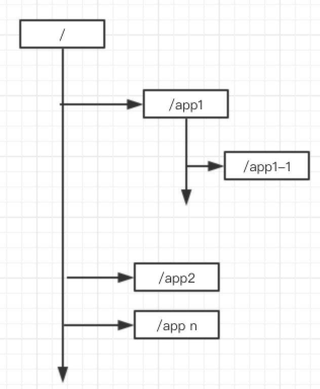
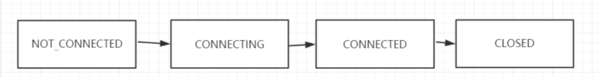
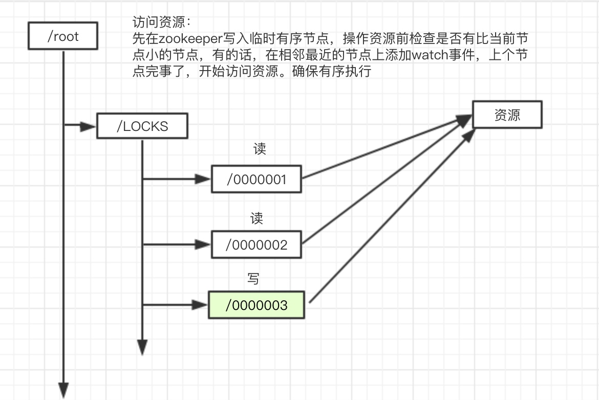

zookeeper 基础🔥
# 分布式普及
## 特点
- 分布性：处于分布式式环境的机器可能分布在天南海北
- 并发性：同一个分布式系统的多个节点，`同时`访问同一个资源
- 无序性：进程间的消息通信，会出现无序性，（导致事物问题）

## 问题
- 网络通信：网络本身的不可靠性，导致的通信问题
- 网络分区：节点数据过多时，会出现一部分机器失联的情况，失联的机器选举出leader,导致多leader出现
- 三态：分布式架构中除了成功、失败、还有超时
- 分布式事物：ACID(原子性、一致性、隔离性、持久性)

## 经典的CAP/BASE理论
### CAP
- C 一致性 (Consistency）: 所有节点上的数据，时刻保持一致
- A 可用性（Availability）：每个请求都能够收到一个响应，无论响应成功或者失败p
- p 分区容错（Partition-tolerance）：表示系统出现脑裂以后，可能导致某些server与集群中的其他机器失去联系

实际场景只能满足：CP/AP
### BASE理论
BASE理论是Basically Available(`基本可用`)，Soft State（`软状态`）和Eventually Consistent（`最终一致性`）三个短语的缩写。

- 核心思想：
> 既是无法做到强一致性（Strong consistency），但每个应用都可以根据自身的业务特点，采用适当的方式来使系统达到最终一致性（Eventual consistency）。

- 基本可用：可用允许部分业务异常，电商业务促销情况下，部分消费者被跳转到降级页面
- 软状态：允许从节点存储信息存在延迟，
- 最终一致性：软状态有时间限制，最重要一致

# zookeeper
## 是神马？
> 原文：Apache ZooKeeper is an effort to develop and maintain an open-source server which enables highly reliable distributed coordination.
<hr/>
> 翻译: zookeeper 致力于开发和维护开源服务器，实现高可靠的分布式协调服务

## 能做神马？
- 数据的发布/订阅（配置中心）、
- 负载均衡（dubbo利用zookeeper极致实现负载均衡）、
- 命名服务
- master选举（kafka、hadoop、hbase）、
- 分布式队列、分布式锁、

## 特性
### 顺序一致性
从同一个客户端发起的事务请求，最终会严格按照顺序被应用到zookeeper中

### 原子性
所有的事务请求的处理结果在整个集群中的所有机器上的应用情况是一致的，也就是说，要么整个集群中的所有机器都成功应用了某一事务、要么全都不应用

### 可靠性
 一旦服务器成功应用了某一个事务数据，并且对客户端做了响应，那么这个数据在整个集群中一定是同步并且保留下来的

### 实时性
一旦一个事务被成功应用，客户端就能够立即从服务器端读取到事务变更后的最新数据状态；（zookeeper仅仅保证在一定时间内，近实时）

## 数据模型
数据模型和文件系统类似，每一个节点称为znode,保存zookeeper最小数据单元，每个节点上可以保存数据和挂载子节点。从而构成一个层次化的属性结构


### 节点特性
* 持久化节点  ： 节点创建后会一直存在zookeeper服务器上，直到主动删除
* 持久化有序节点 ：每个节点都会为它的一级子节点维护一个顺序
* 临时节点 ： 临时节点的生命周期和客户端的会话保持一致。当客户端会话失效，该节点自动清理
* 临时有序节点 ： 在临时节点上多了一个顺序性特性

### 会话：
    
### Watcher
zookeeper 提供了分布式数据发布/订阅，zookeeper允许客户端想服务器注册一个watcher监听。服务器节点触发执行事件的时候回触发watcher事件。服务端会向客户端发送一个事件通知
<hr/>
watcher的通知是一次性，一旦触发一次通知后，改watcher就失效了

### ACL
zookeeper提供`控制节点访问权限`的功能，用于有效的保证zookeeper中数据的安全性。避免误操作而导致系统出现重大事故。
<hr/>
CREATE /READ/WRITE/DELETE/ADMIN

## JAVA客户端
权限控制模式Schema（授权策略）：

|模式|介绍|
|---|---|
ip     | 192.168.1.1
Digest  | username:password
world  | 开放式的权限控制模式，数据节点的访问权限对所有用户开放。 world:anyone |
super  |超级用户，可以对zookeeper上的数据节点进行操作

- 原生：难用，每次都需要手动watcher,添加监听（监听是异步的，只发送一次事件），费劲
- zkClient: 封装的一般，使用异常做流程控制
- curator ：使用方便，封装的很nice，支持fluent就是.模式

## 实际应用场景
### 分布式锁🔐
实现原理：利用其特性（有序、watch事件）
* [x] 加锁
    ```
    访问资源前：在zookeeper创建对应资源的Locks锁的临时有序节点、访问时获取Lock节点下的所有临时节点，看刚创建的临时节点是否是最小的，是就获取资源，否就在其相邻的上个节点中添加删除监听。
    注:监听事件是异步的、需要使用阻塞式方法等待监听结果
    ```
* [x] 释放锁
    ```
    就是把刚创建的zookeeper临时有序节点给删除了
    ```

原理图：


### Master选举
实现原理：
 - 利用zookeeper节点特性：不可重复-多个节点抢注master,只能有一个成功
 - 节点统一添加/master监听，master挂掉、其他几个节点抢注master

> 注：监听方法是异步阻塞的，原生的api需要在监听后重复添加监听，可以使用zkClient或curator

# 源码地址
[github地址](https://github.com/nbdoc/rpc-base)
